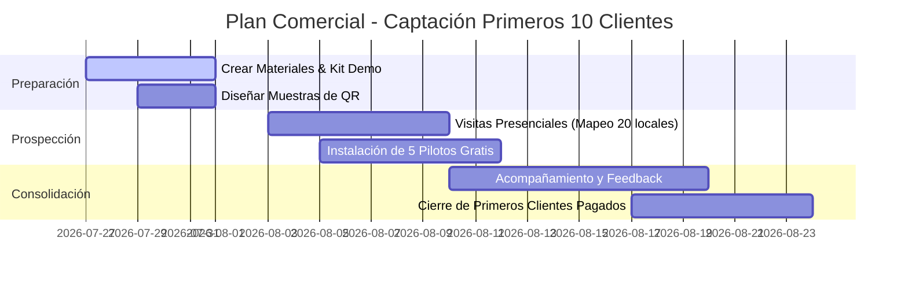

# Plan Comercial y Estrategia Go-To-Market (GTM) — Garzón Digital

> **Actualizado 2026-08-12.** El dueño validó el precio: **un solo plan, $29.900/mes**, sin
> comisión ni permanencia. La suscripción ya está implementada en el producto (F10): prueba de 30
> días, 7 de gracia y corte de pedidos en el servidor. El material de venta para usar en terreno es
> **[`PITCH-VENTAS.md`](PITCH-VENTAS.md)** — este documento es la estrategia; ese es el guion.

Este documento establece la estrategia comercial táctica para conseguir los **primeros 5 a 10 clientes pagados (o pilotos activos)** para Garzón Digital en el mercado gastronómico chileno, antes de abordar la Fase 5 (Dominios Propios).

---

## 🎯 1. Perfil del Cliente Ideal (ICP - Ideal Customer Profile)

Para los primeros clientes, **evitamos cadenas grandes** (procesos de decisión lentos) y **evitamos locales de alta cocina con servicio formal complejo**.

### Target Prioritario:
- **Tipo de Local:** Fuentes de soda, sangucherías, pizzerías casuales, cafeterías de alto flujo, locales de comida rápida / smash burgers, y food trucks / patios de comida.
- **Tamaño:** 5 a 20 mesas (o barra / retiro presencial).
- **Personal:** 1 a 3 personas en cocina, 1 o 2 garzones (o sin garzón / autoservicio).
- **Pain Points Principales:**
  1. **Cuello de botella en hora punta:** Los clientes esperan mucho para que les tomen la orden o pedir la cuenta.
  2. **Errores de comanda:** Comandas a mano ilegibles o perdidas entre garzón y cocina.
  3. **Costo de cartas impresas:** Precios cambian por inflación o insumos agotados ("se acabó la palta"), y reimprimir cartas es caro e inflexible.
  4. **Costos altos de software actual:** Los POS tradicionales (Toteat, Fudo, Justo, etc.) cobran comisiones por venta o planes de $40.000–$80.000+ CLP/mes con contratos anuales rígidos.

---

## 💰 2. Estrategia de Precios y Empaquetado (Pricing en CLP)

Propuesta de modelo **SaaS con tarifa plana mensual por local, SIN comisiones por pedido**.

### 🌟 Oferta Lanzamiento:
- **Plan Pro Mensual:** **$29.900 CLP / mes** por local (o **$249.900 CLP / año** = ~2 meses gratis).
  - Incluye: Menú QR ilimitado, Pantalla Kanban de Cocina en tiempo real, Panel de gestión de productos/precios/fotos, alertas sonoras y soporte por WhatsApp.
  - **Sin comisión por venta** (0% vs. 2%-5% de otras plataformas).
  - **Sin contrato de arriendo/permanencia** (cancela cuando quieras).
- **Kit de Inicio / Setup (Opcional o Bonificado):** **$15.000 CLP** (Pago único).
  - Incluye: Configuración inicial del menú por nosotros + diseño e impresión de 10 a 15 stickers/display acrílicos con el código QR para las mesas. *(Gratis si contratan el plan anual).*

---

## 🚀 3. Estrategia de Captación de los Primeros 5-10 Clientes

### Canal #1: Venta Presencial "Puerta a Puerta" (El canal #1 en Gastronomía Chile)
En gastronomía, los dueños/administradores están en el local temprano (10:30 - 11:30 hrs) o entre turnos (16:00 - 17:30 hrs).

**El Pitch "Demo en 60 Segundos":**
1. **Llegada:** *"Hola, soy [Nombre], creador de Garzón Digital. Desarrollé un sistema chileno para que los clientes pidan desde la mesa con su teléfono sin esperar garzón y la orden suene al instante en tu cocina."*
2. **Demo en vivo:** Llevas un sticker QR de prueba en tu teléfono/tarjeta y una tablet o tu celular en modo Dashboard Cocina. Le pides al dueño que escanee el QR con su propio teléfono, haga un pedido de prueba, y le muestras cómo suena y parpadea la pantalla de cocina en 3 segundos.
3. **Gancho:** *"Te lo dejo instalado hoy mismo con 30 días 100% gratis. Si en un mes ves que la cocina saca los pedidos más rápido y no se pierde ninguna comanda, seguimos por $29.900 al mes. Si no te sirve, te retiras sin pagar ni un peso."*

### Canal #2: Programa "Clientes Faro" (Lighthouse Clients - 5 Pilotos Exclusivos)
Ofrecer a los primeros 5 locales una alianza estratégica:
- **Beneficios para el local:** 30 días de prueba gratuita + Kit de QRs impresos de regalo + acompañamiento presencial el primer día de uso.
- **Requisito a cambio:** Permitirnos tomar fotos/videos del local usando el sistema, dar un testimonio breve de 30 segundos en video y darnos feedback semanal de uso.

### Canal #3: Outreach Directo & Redes Sociales
- **Instagram / TikTok:** Crear videos cortos tipo Reel mostrando el dolor común:
  - *“Cliente esperando 15 min al garzón vs. cliente pidiendo en 10 segundos con Garzón Digital”*.
- **Directo en Instagram:** Contactar a sangucherías y locales gastronómicos de tu comuna (Providencia, Ñuñoa, Barrio Italia, Santiago Centro, Viña, Concepción, etc.) que tengan buen flujo pero sin sistema de pedidos digital.

---

## 🛠️ 4. Kit Comercial Necesario (Herramientas de Ventas)

Para ejecutar esta estrategia necesitaremos preparar:

1. **Demo Landing Page:** Asegurar que la landing pública (`/`) o `/local/demo` tenga el botón *"Probar Demo en Vivo"* bien visible para que un dueño pueda probarlo desde su propio teléfono sin registrarse.
2. **Tarjeta / Flyer de Presentación:** Con un QR que abra el menú demo de *"Fuente de Soda El Lalo"*.
3. **Muestra Física de QR:** 1 o 2 habladores de mesa de acrílico/madera de muestra para llevar a las reuniones.
4. **Plantilla de Alta Rápida:** Formulario de 5 minutos para que el dueño nos pase su carta en PDF/foto y nosotros le dejemos el local activo mediante `/dashboard/admin` en menos de 2 horas.

---

## 📅 5. Plan de Acción Ejecutable (Roadmap Comercial de 4 Semanas)

### Semana 1: Armado del Kit Comercial
- Ajustar la landing pública con propuesta de valor clara y demo en vivo.
- Mandar a imprimir 10 muestras de QR acrílicos de prueba.
- Definir lista de 20 locales candidatos en la zona objetivo.

### Semana 2: Campaña de Prospección y Pilotos
- Visitar 20 locales en horarios de bajo flujo (10:30-11:30 y 16:00-17:30).
- Cerrar **5 locales piloto** con 30 días gratis y configuración de carta incluida.

### Semana 3: Operación & Soporte Intensivo
- Acompañar a los locales en su primera jornada de uso.
- Medir métricas de uso (pedidos procesados, tiempo de atención).
- Recoger testimonios y fotos/videos de uso real.

### Semana 4: Conversión a Pago & Casos de Éxito
- Presentar reporte de valor al dueño (*"Este mes procesaste X pedidos por la plataforma de forma fluida"*).
- Convertir los 5 pilotos a suscripción mensual pagada ($29.900 CLP/mes).
- Publicar el primer caso de éxito para acelerar ventas de los siguientes 5-10 clientes.

---

## ❓ Preguntas de Alineación para el Dueño del Producto

Antes de iniciar la ejecución comercial, validemos los siguientes puntos:

1. ~~**Precio**~~ — **resuelto el 2026-08-12:** un solo plan de $29.900/mes ($249.900/año), sin
   comisión por venta ni permanencia. Ya está implementado en el producto.
2. **Zona de Pilotaje:** ¿En qué comuna/zona geográfica tienes facilidad para hacer las primeras visitas presenciales?
3. **Impresión de QRs:** ¿Gestionamos las primeras impresiones de QRs con un proveedor local de gráfica/imprenta?
4. **Anti-abuso del checkout:** sigue pendiente desde F8 (ver [`F8-CONFIANZA.md`](F8-CONFIANZA.md)).
   Con cinco pilotos no es un problema; conviene decidirlo antes de llegar a veinte locales.
